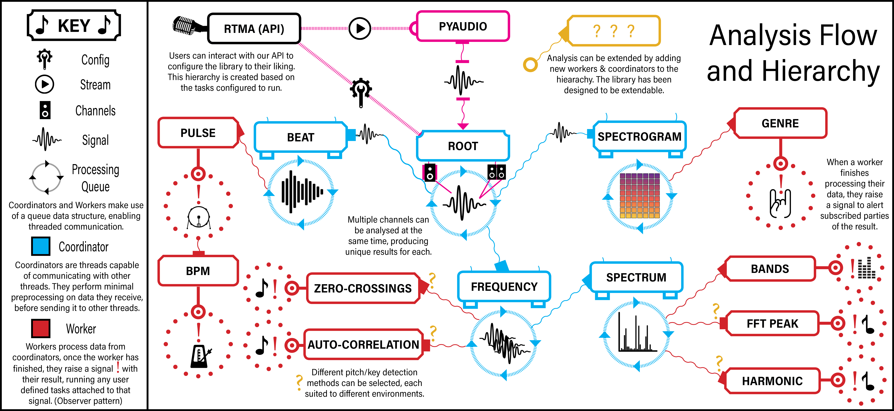
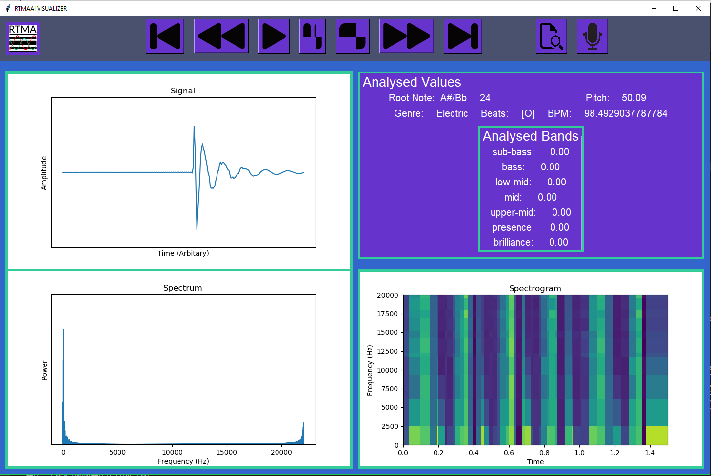
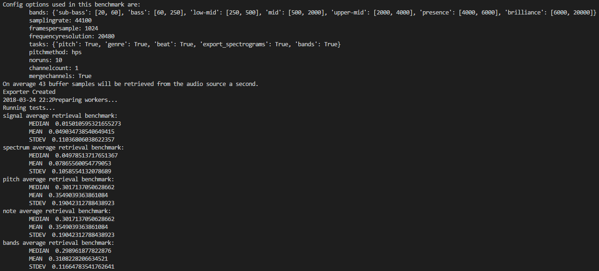
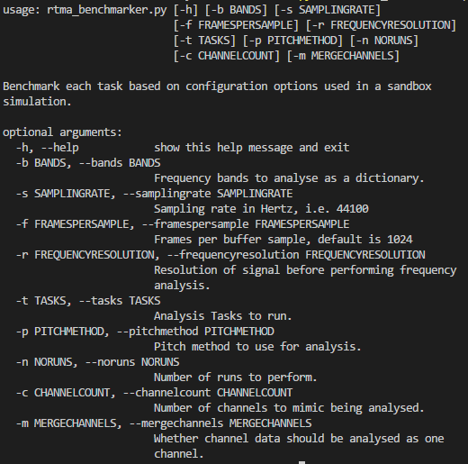

[](https://coveralls.io/github/RTMAAI/CO600-Musical-Analysis?branch=master)
[](https://travis-ci.org/RTMAAI/CO600-Musical-Analysis)
[](https://bettercodehub.com/)


# Authors

* Laurent Baeriswyl
* Ralph Jacob Raule
* Andrew Harris

# Description

RTMA is a Python library that allows you to monitor live music and create audio-responsive software!

## Features

* Detects and responds to beats in a signal.
* Performs BPM analysis
* Fundamental Pitch and Note analysis
* Frequency band analysis
* Genre classification

...All in real time!

Our library's tasks are built as a hierarchy of threaded workers, we sample audio data using a Python wrapper called Pyaudio which sits on top of Portaudio an audio IO library.

This sampled audio data is sent down through our hierarchy to each our nodes in the hierarchy.



Some of the nodes in our hierarchy will raise event signals (Shown by the **!** in the image above.)

Any function can be set up to receive these signals, meaning any time a signal is raised the function will be called.

This is achieved through Pydispatcher, which is an implementation of the Observer pattern.

By hooking up a function to an event, you can use to function to retrieve any metric we analyse and do any further processing.

### Why Use This Library

For example, imagine you were writing a video game which had a beautiful soundtrack, but you felt like the soundtrack doesn't match the gameplay.

You could use our library to analyse the soundtrack, listening to the BPM, speeding up enemy movement based on the current average.

Or you could check for each beat that occurs in a soundtrack, and cause enemies to move only when this happens.

Maybe you want to find out the genre of a song, use our classification, and change environments based on it.

Perhaps you are creating a runner game, you could create platforms on the fly based on the fundamental pitch of the song.

Making steps higher as the pitch rises, and steps lower as it drops.

The possibilities are endless and our library provides you the means to extend these possibilities!

# Getting Started

## Windows

Installing our library (PowerShell):

```powershell
    # With Project Folder as current context
    python -m virtualenv VENV # Just to make sure you are using same package versions
    .\init.ps1 # Installs python packages and activates virtualenv
```

## Linux

Linux users will first need to install and compile [Portaudio](http://www.portaudio.com/), in order for Pyaudio to be installed.

Please refer to [this](https://askubuntu.com/questions/736238/how-do-i-install-and-setup-the-environment-for-using-portaudio) helpful stackoverflow article for set up steps.

Installing our library (Bash):

```bash
    # With Project Folder as current context
    python -m virtualenv venv # Just to make sure you are using same package versions
    .\init.sh # Installs python packages and activates virtualenv
```

## Mac

Mac users will first need to install [Portaudio](http://www.portaudio.com/), in order for Pyaudio to be installed.

This can be achieved using [Homebrew](https://brew.sh/)

```bash
    brew install portaudio
```

Installing our library (Bash):

```bash
    # Some issues may arise due to how matplotlib interacts with python on mac
    # With Project Folder as current context
    python3 -m venv venv # Use python3's venv over virtualenv
    .\init.sh # Installs python packages and activates the virtual environment
```

## Example implementation

Please see the file example_implementation.py for an example implementation using the libraries API.

This gives a basic overview of how you would interact with our API and get started with implementing our analysis.

## Visualizer/Debugger



Bundled with our repository, is a script called *debugger.py*

Running ```python .\debugger.py``` will open a Tkinter UI which can be used to run our library and visualize the analysis.

We recommend that you run this first, to get a feel for what the library can analyse.

This script is implemented on top of our library, so you could easily create an application in a similar vain.

If this script fails to run, please open an issue with any errors you encountered and we'll do our best to fix it asap!


Our rewind controls don't control playback of an audio source (As you can't rewind live audio.).

If you pause the analysis, you can rewind through the last 50 metrics that were analysed, seeing exactly when a beat occured for example.
# Usage

## Prerequisites

This library requires a few pre-requisites in order to run as expected.

* Python version 3+ must be installed.
* All packages within requirements.txt must be installed. (This can be accomplished using the init script)
* Portaudio must be installed on Linux/Mac OSes

## System Requirements

To run our analysis in realtime we have a few requirements, depending on how you configure your library the response of metrics may be slower or faster. We recommend you read through our documentation on Configuration and use our Benchmarking script to find a configuration with a delay you can handle i.e. < 0.5 ms.

* RAM: 2 GB
* CPU: 1.5 GHz+
* To test whether your system can handle realtime analysis please see our **Benchmarking** section.

### Overview

To use the library you will first need to import the rtmaii module into the script you want to use it in.

```python
from rtmaii import Rtmaii
```

----

All the functionality of rtmaii is contained within the Rtmaii class, there are a variety of ways to initiliaze the library.

```python
analyser = rtmaii.Rtmaii([{'function': pitch_callback, 'signal': 'frequency'}],
                            source = r'.\test_data\spectogramTest.wav',
                            config = {
                                'bands': {'myband': [0, 2000]}
                            },
                            mode = 'DEBUG'
                            )
```

For a rundown of the tasks offered within our library see the **Tasks** section below.

For more information on the configuration options available, please see the **Config** section.

----

Rtmaii uses an event driven callback system to provide your scripts with updates on the state of analysis.

```python
def pitch_callback(pitch):
    print(pitch)

analyser = rtmaii.Rtmaii([{'function': pitch_callback, 'signal':'frequency'},
                            source=r'.\test_data\spectogramTest.wav')
```

For more information on the signals available and the data they return, please see the **Callbacks** section.

----

To run analysis you will need to call the start() method on the generated analysis object.

```python
analyser.start()

# Runs forever whilst analyser is active, when a track is used will run until it's finished.
while analyser.is_active():
    pass
```

There are a variety of methods that can be called on the object, please see the **API** section below for more detail.

----

Can't find a task for a metric you want to analyse? Our library allows you to attach new tasks to the analysis with ease.

Don't like the structure of our analysis? Then you can configure it to suit your needs!

```python
analyser.remove_node('SpectrumCoordinator')

analyser.add_node('CustomCoordinator')
```

For detailed information on how to develop your own analysis task/hierarchy, please see our **Custom Hierarchy** section.

# Configuring Audio Source

Our library supports both live audio analysis and audio file analysis.

The audio source can either be configured when initialising the library.

```python
# Using a wav file for audio analysis.
analyser = rtmaii.Rtmaii(source=r'.\\Tracks\\LetItGo.wav')
```

```python
# Using an audio input ID, if the source is not specified, the default input device on your system will be used.
analyser = rtmaii.Rtmaii(source=1)
```

Or changed using our object's set_source() method, allowing you to reuse our analysis object over multiple tracks.

```python
analyser.set_source('.\\Tracks\\LetItGo.wav')
```

**Warning: If you have changed the default audio device settings, i.e. the amount of channels or sampling rate it users. You will need to provide these in the kwargs to avoid any artefacts in the analysis.**

```python
analyser.set_source(1, **{'rate': 96000, 'channels': 3})
```

If you are unsure of the ID of your audio devices, please run.

```python
analyser.get_input_devices()
```

This will print out the input devices on your system along with their IDs.


# Tasks

We offer a number of built in tasks, each analysing different aspects of a signal.

These tasks are all enabled by default, so to retrieve their results, make sure to attach a callback to one of their signals.

## Beat detection & BPM analysis

If you need to detect when a beat has occured in a track or in live audio, listen to our 'Beat' signal.

We also calculate an estimate of the BPM based on the time difference between each beat in a track.

**Task**: ['Beat']
**Signals Produced**: ['Beat', 'BPM']

## Pitch & Note

We analyse the fundamental frequency (Pitch) of each sample, generating an event containing the result in Hertz.

Further to this, we also perform some small mathmetical equations to find the closest root note on a piano to the fundamental frequency.

The cents off from the root note is also returned in our analysis.

**Task**: ['Pitch']
**Signals Produced**: ['Pitch', 'Note']

## Genre

Our library employs a convolutional neural network (CNN) in our analysis chain.

It classifies the genre of an audio source based on spectrograms that are created from the audio.

Using these images the CNN is able to find patterns that are common in specific genres.

The network currently can classify between, electronic, rock, hip-hop and folk music.

**Task**: ['Pitch']
**Signals Produced**: ['Pitch', 'Note']

## Frequency band presence

During analysis we perform a fourier transform on the input signal to convert the signal to the frequency domain.

From here we can analyse the presence of a given frequency range.

Further to this, we also perform some small mathmetical equations to find the closest root note on a piano to the fundamental frequency.

**Task**: ['Pitch']
**Signals Produced**: ['Pitch', 'Note']

# Config

There are a variety of configuration options for the library that can help to tune performance and accuracy if correctly configured.

## Defaults

```python
"merge_channels": True,
"bands": {
        "sub-bass":[20, 60],
        "bass":[60, 250],
        "low-mid":[250, 500],
        "mid":[500, 2000],
        "upper-mid":[2000, 4000],
        "presence":[4000, 6000],
        "brilliance":[6000, 20000]
},
"tasks": {
    "pitch": True,
    "genre": True,
    "beat": True,
    "bands": True
},
"frequency_resolution": 20480,
"pitch_algorithm": "auto-correlation",
"frames_per_sample": 1024
```

## Merge channels

```python
"merge_channels": True
```

The merge channels setting controls whether analysis should be done against each channel in the audio source, or a single combined channel.

**Please note that analysing multiple channels raises the computational cost by a factor of N, where N is the number of channels! Be wary of disabling this.**

Disabling tasks that aren't needed can help to reduce this cost, if you do want to analyse different audio interface channels, i.e. a Bassist seperately from a Guitarist.

## Pitch method

There are multiple pitch detection methods available in the library, each with their own advantages in different environments.

```python
"pitch_algorithm": "ac" | "zc" | "hps" | "fft"
```

### AutoCorrelation (AC)

Estimate pitch using the [autocorrelation](https://cnx.org/contents/i5AAkZCP@2/Pitch-Detection-Algorithms) method.

*Advantages*:

* Good for repetitive wave forms, i.e. sine waves/saw tooths.
* Represents a pitch closer to what humans hear.

*Disadvantages*:

* Requires convolution to be applied which can be expensive.
* Not great with inharmonics i.e. Guitars/Pianos.
* Accuracy is reduced with sampling rate.

### Zero-Crossings (ZC)

Estimate pitch by simply counting the amount of [zero-crossings](https://ccrma.stanford.edu/~pdelac/154/m154paper.htm).

*Advantages*:

* Good for intermittent stable frequencies, i.e. Guitar Tuners.
* Fast to compute, don't need to apply an FFT.

*Disadvantages*:

* If there is lots of noise or multiple frequencies doesn't work.

### Harmonic Product Spectrum (HPS)

Estimate pitch using the [harmonic product spectrum](http://musicweb.ucsd.edu/~trsmyth/analysis/Harmonic_Product_Spectrum.html) algorithm.

*Advantages*:

* This method is good at finding the true fundamental frequency even if it has a weak power or is missing. The technique amplifies the frequency that the harmonics are a multiple of.

*Disadvantages*:

* Slower than using a naive FFT peak detection and requires a fourier transform, which can be computationally expensive.

### FFT Peak (FFT)

Estimate pitch by finding the peak bin value of the frequency spectrum.

*Advantages*:

* More accurate than Zero-crossings.

*Disadvantages*:

* Not great at detecting pitch with multiple harmonics that have a higher amplitude than the fundamental frequency.
* Requires a fourier transform, so more computationally expensive than zero-crossings.

## Bands

## Frames per buffer

## Frequency Resolution

## Task Config

# API

## Callbacks

### Adding receivers

### Removing receivers

# Custom Hierarchy


# Benchmarking

Our library has been developed on a variety of systems, however, we can't assure that the analysis will remain realtime.

For this purpose we have developed a benchmarking script, that is included with the repository.

To test the average response time of our tasks, run the code below in your cloned folder.

```python
   python .\rtma-benchmarker.py
```

This will run a number of benchmarks on our nodes against your system.



The results show the average time in seconds, it takes for an audio signal to reach each node and invoke a callback.

If the response times are not adequate, then you can try to find a set of configuration options that match the performance you need.



Running ```python .\rtma-benchmarker.py -h``` will return all the parameters that can be fed into the script for benchmarking.

For example, if the pitch response was too slow, you could try use the zero-crossings method, by supplying the script with the -p param.

```python
   python .\rtma-benchmarker.py -p 'zc'
```

Careful tuning of the system can allow the library to run at realtime on lower spec systems.

Making sure to disable unused systems will also save a huge amount of CPU cycles.

# Testing the library

Our tests are contained within the library itself so can be run at anytime to check for issues.

To run the tests open the folder containing the library and run:

```powershell
    python -m unittest discover
```

## TODOs:
* Add rewind functionality to debugger
* Add source configuration to debugger
* Fix HPS
* Update hierarchy
* Tinker with configurable settings

        **Advantages**:
            - This method is good at finding the true fundamental frequency even if it has a weak power or is missing.
              The technique amplifies the frequency that the harmonics are a multiple of.
        **Disadvantages**:
            - Slower than using a naive FFT peak detection and requires a fourier transform, which can be computationally expensive.
